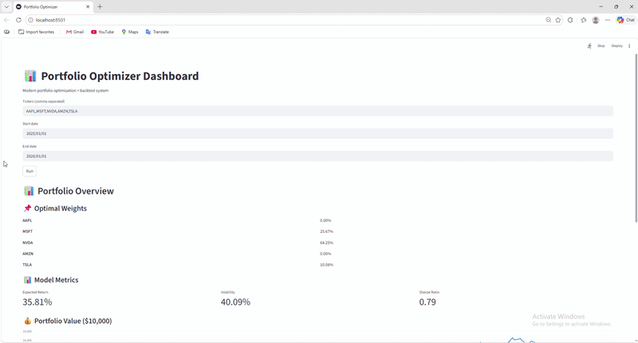

# 📊 Portfolio Optimizer (Quant Finance Project)

## 📷 Demo

---

## 🔥 Overview
This project is a portfolio optimization and backtesting system built using Python and Streamlit.

It allows users to input stock tickers and generate an optimal portfolio allocation using Modern Portfolio Theory, then evaluate performance using historical backtesting.

---

## 🎯 Key Features
- Portfolio optimization (Sharpe ratio maximization)
- Backtesting using historical market data
- Benchmark comparison (Equal-weight portfolio)
- Interactive Streamlit dashboard
- Portfolio value simulation with initial capital ($10,000)

---

## 🧠 Methodology

Modern Portfolio Theory is used to optimize risk-adjusted return.

Steps:
1. Compute historical returns
2. Estimate expected return & covariance
3. Optimize portfolio weights
4. Backtest performance
5. Compare with benchmark

---

## 📊 Outputs
- Optimal portfolio weights
- Expected return, volatility, Sharpe ratio
- Equity curve ($10,000 initial capital)
- Benchmark comparison

---

## 🛠 Tech Stack
- Python
- Streamlit
- Pandas
- NumPy
- SciPy
- Yahoo Finance API

---

## 📈 Example
Input:
AAPL, MSFT, NVDA, AMZN, TSLA

Output:
- Optimal weights
- Portfolio performance
- Equity curve comparison

---

## ⚠️ Limitations
- Uses historical data only
- No transaction cost modeling
- No predictive ML model

---

## 🚀 Future Improvements
- Walk-forward optimization
- Risk parity portfolio
- Transaction cost modeling
- Real-time data integration

---

## 👨‍💻 Author
Nhat Quang  
Applied & Computational Mathematics Student
